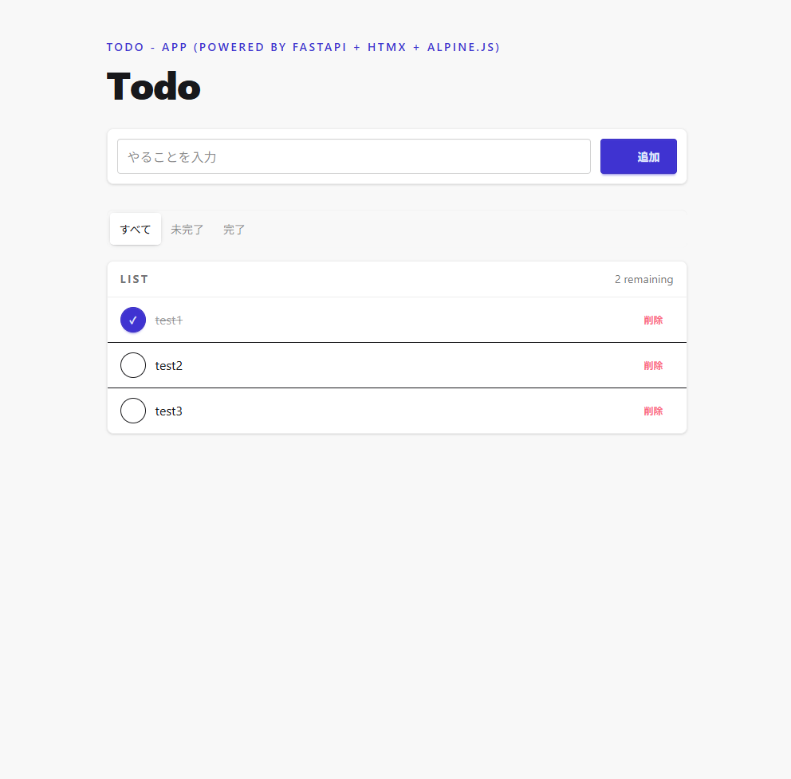

# FastAPI + htmx for Todo-App

## 概要

本リポジトリは`FastAPI`+`htmx`を中心とした技術スタックによるTodo-appです。

- ヒーローページ<br/>
  

## 技術スタック

| 技術 | 用途 |
| --- | --- |
| FastAPI | Web フレームワーク |
| SQLModel + SQLite | ORM によるデータモデル定義とデータ永続化 |
| HTMX | サーバーが返す HTML 断片による非同期 UI 更新 |
| Jinja2 | HTML テンプレートエンジン |
| Alpine.js | 軽量な UI インタラクション（トグル・モーダル等）の付与 |
| Tailwind CSS | ユーティリティベースのスタイリング |
| daisyUI | Tailwind 上に構築された UI コンポーネント・テーマ |

## セットアップ

```bash
uv sync
```

## 開発用起動コマンド

```bash
uv run fastapi dev --host 0.0.0.0
```
